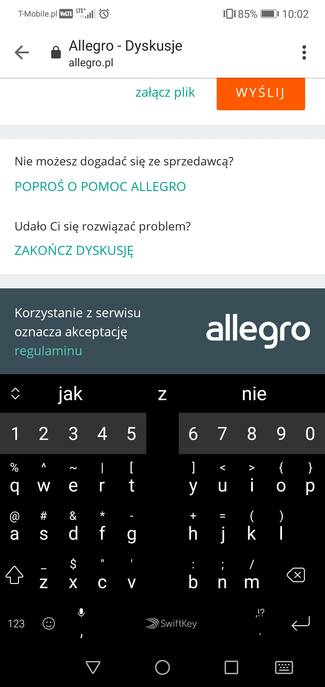

# Exploration Testing 1
> 

## Table of contents
* [General info](#general-info)
* [Screenshots](#screenshots)
* [Technologies](#technologies)
* [Steps](#steps)
* [Result](#result)
* [Expected result](#expected-result)

## General info
Exploration testing project created to train testing skills after testing course.

## Screenshots

## Technologies
* System: Android DT.POL. 9.1.0.5(CT.F01) (9.1.0.306(C432E6R1P7))
* Web Browser: Google Chrome 81.0.4044.138

## Steps
* Open site: http://allegro.pl/
* Log on to existing user profile with valid credentials
* Click "Obserwuję" section below, and then click "Moje Allegro" above
* Click "Wsparcie pozakupowe" and then "Dyskusje"
* Scroll down and click "Zobacz Dyskusję" 
* Touch the text field to leave a comment

## Result
* The keyboard appears on the screen, but the whole page with the text field moves up, 
so it's not visible anymore and we don't see what we are typing.

## Expected result
* Expected result:
The text field is just above the keyboard.