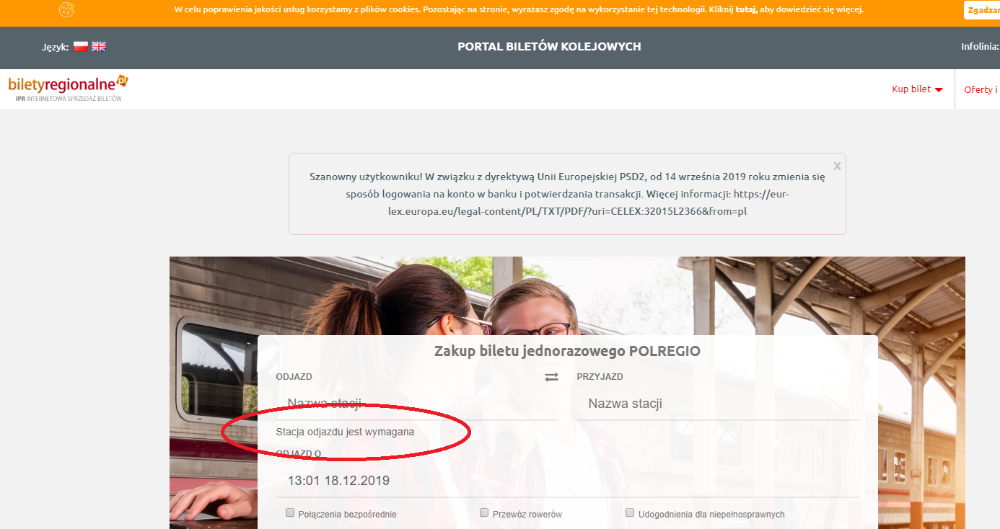

# Exploration Testing 1
> https://kup.biletyregionalne.pl/

## Table of contents
* [General info](#general-info)
* [Screenshots](#screenshots)
* [Technologies](#technologies)
* [Steps](#steps)
* [Result](#result)
* [Expected result](#expected-result)

## General info
Exploration testing project created to train testing skills after testing course.

## Screenshots

## Technologies
* System: Windows 10 Pro ver. 1903
* Web Browser: Google Chrome ver. 78.0.3904.108

## Steps
* Open site: https://kup.biletyregionalne.pl/
* Click "biletyregionalne" logo on the top left corner of the site.

## Result
* New site doesn't open. Instead the site says: "Stacja odjazdu jest wymagana" below the first field.

## Expected result
* Expected result:
The main site https://www.biletyregionalne.pl/ opens.