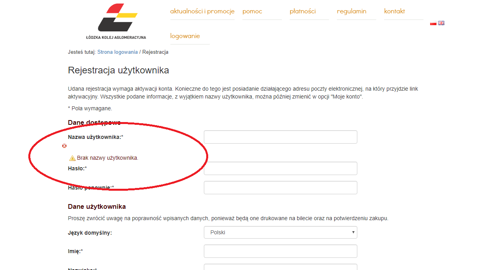

# Exploration Testing 1
> https://www.biletylodzkie.pl/

## Table of contents
* [General info](#general-info)
* [Screenshots](#screenshots)
* [Technologies](#technologies)
* [Steps](#steps)
* [Result](#result)
* [Expected result](#expected-result)

## General info
Exploration testing project created to train testing skills after testing course.

## Screenshots

## Technologies
* System: Windows 10 Pro ver. 1903
* Web Browser: Google Chrome ver. 78.0.3904.108

## Steps
* Open site: https://www.biletylodzkie.pl/
* Click "Zarejestruj się" button on the bottom right. You will land on the registration site
* Put some numbers in the "Nazwa użytkownika" field
* Click "Zarejestruj" button on the bottom of the site

## Result
* The site says: "Brak nazwy użytkownika." below the first field and shows a red cross sign above

## Expected result
* Expected result:
The site scrolls up to the bottom after clicking "Zarejestruj" button with wrong registration details.
Next to red cross, the site should give an information about the valid characters for the first field