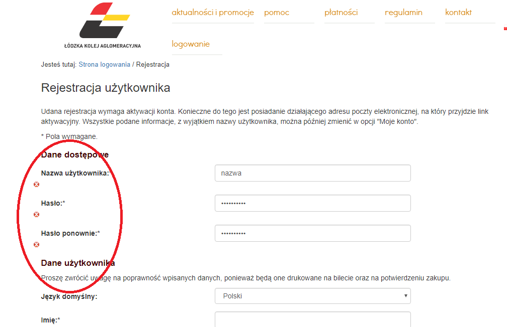

# Exploration Testing 1
> https://www.biletylodzkie.pl/

## Table of contents
* [General info](#general-info)
* [Screenshots](#screenshots)
* [Technologies](#technologies)
* [Steps](#steps)
* [Result](#result)
* [Expected result](#expected-result)

## General info
Exploration testing project created to train testing skills after testing course.

## Screenshots

## Technologies
* System: Windows 10 Pro ver. 1903
* Web Browser: Google Chrome ver. 78.0.3904.108

## Steps
* Open site: https://www.biletylodzkie.pl/
* Click "Zarejestruj się" button on the bottom right. You will land on the registration site
* Put a valid user name (e.g. nazwanazwa), set a valid password
* Clear all the fields, you've just filled
* Click "Zarejestruj" button on the bottom of the site

## Result
* The site shows red crosses signs next to username and passwords fields, but without any word next to it

## Expected result
* Expected result:
The site scrolls up to the bottom after clicking "Zarejestruj" button.
Next to every red cross sign, the site should give an information: "Wymagane!"