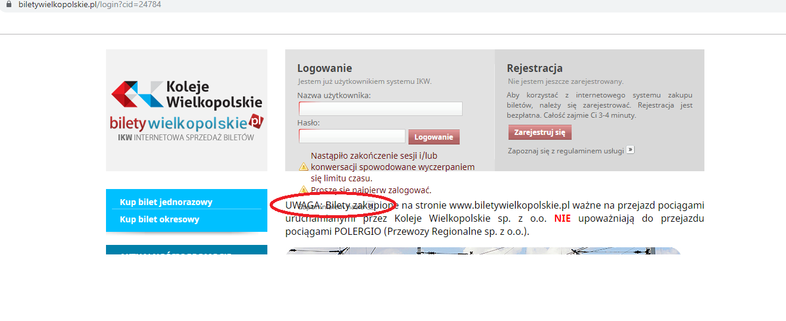

# Exploration Testing 1
> https://www.biletywielkopolskie.pl/

## Table of contents
* [General info](#general-info)
* [Screenshots](#screenshots)
* [Technologies](#technologies)
* [Steps](#steps)
* [Result](#result)
* [Expected result](#expected-result)

## General info
Exploration testing project created to train testing skills after testing course.

## Screenshots

## Technologies
* System: Windows 10 Pro ver. 1903
* Web Browser: Google Chrome ver. 78.0.3904.108

## Steps
* Open site: https://www.biletywielkopolskie.pl/
* Wait 15 minutes
* Click "Logowanie" button without filling any fields

## Result
* Information about the end of the session and the "Zapomniałem hasła" button are below 
 the logging field and not visible, as they are over a text field on the site.
* The "Zapomniałem hasła" button is not active.

## Expected result
* Expected result:
All the buttons and information are visible and displayed within the logging field.
The "Zapomniałem hasła" button is active.