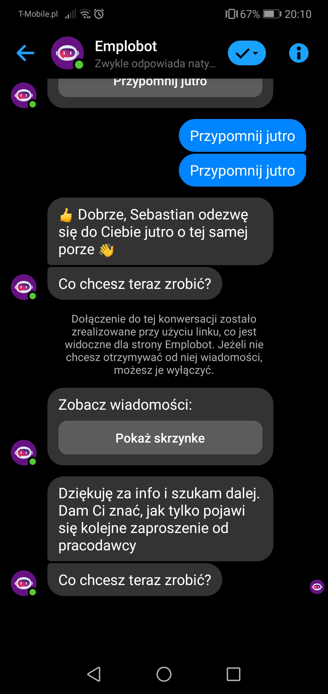

# Exploration Testing 1

## Table of contents
* [General info](#general-info)
* [Screenshots](#screenshots)
* [Technologies](#technologies)
* [Steps](#steps)
* [Result](#result)
* [Expected result](#expected-result)

## General info
Exploration testing project created to train testing skills after testing course.

## Screenshots

## Technologies
* System: Android 9.1.0.306(C432E6R1P7)
* Application: Messenger ver. 268.0.0.15.118

## Steps
* Open Messenger application
* Click existing conversation with Emplobot with job offers
* Click "Przypomnij jutro"
* Emplobot asks "Co chcesz teraz zrobić?"

## Result
* There is an empty field below the last question

## Expected result
* Emplobot should view at least two buttons of actions available below the last question.