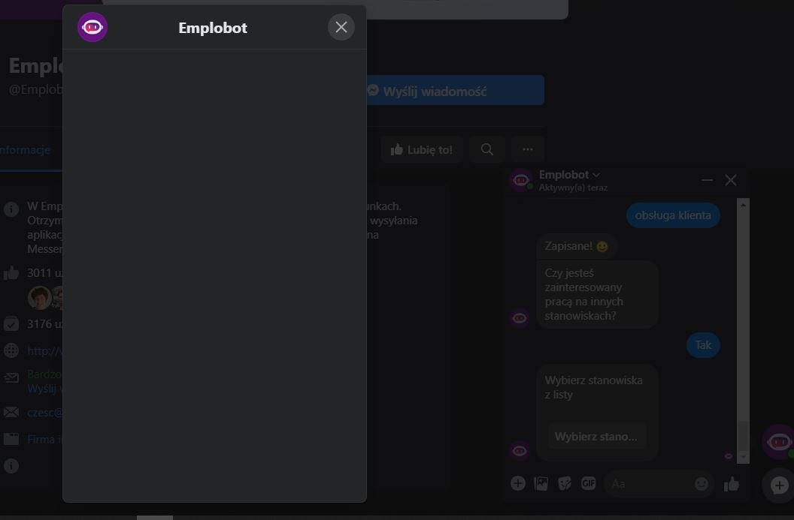

# Exploration Testing 1

## Table of contents
* [General info](#general-info)
* [Screenshots](#screenshots)
* [Technologies](#technologies)
* [Steps](#steps)
* [Result](#result)
* [Expected result](#expected-result)

## General info
Exploration testing project created to train testing skills after testing course.

## Screenshots

## Technologies
* System: Windows 10 Pro ver. 1903
* Web Browser: Google Chrome 83.0.4103.97

## Steps
* Open Messenger application
* Click Emplobot advert
* Create a profile
* When Emplobot asks "Czy jesteś zainteresowany pracą na innych stanowiskach?" click 'Tak"
* Then click "Wybierz stanowiska"

## Result
* An empty window opens

## Expected result
* Expected result:
Emplobot should open window with a list of positions to choose from.