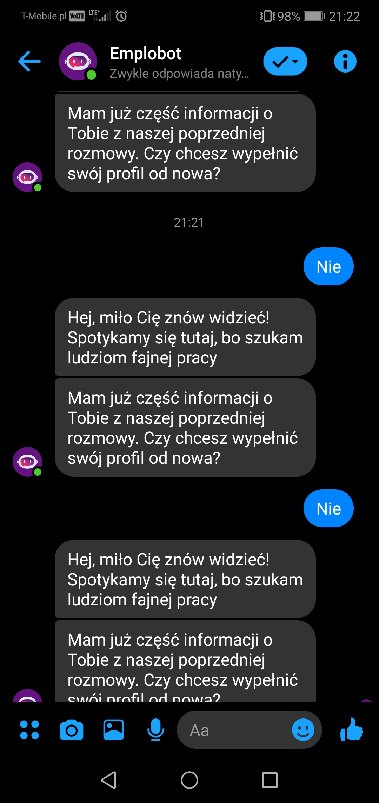

# Exploration Testing 1

## Table of contents
* [General info](#general-info)
* [Screenshots](#screenshots)
* [Technologies](#technologies)
* [Steps](#steps)
* [Result](#result)
* [Expected result](#expected-result)

## General info
Exploration testing project created to train testing skills after testing course.

## Screenshots

## Technologies
* System: Android DT.POL. 9.1.0.5(CT.F01) (9.1.0.306(C432E6R1P7))
* Web Browser: Google Chrome 81.0.4044.138

## Steps
* Open Messenger application
* Type Emplobot in the search field and click the previous existing conversation
* When Emplobot asks You "Czy chcesz wypełnić swój profil od nowa" click "Nie"

## Result
* Emplobot asks the same question again "Czy chcesz wypełnić swój profil od nowa?" and expects the answer "Tak" lub "Nie"

## Expected result
* Expected result:
Emplobot should go further with the application process and ask another question