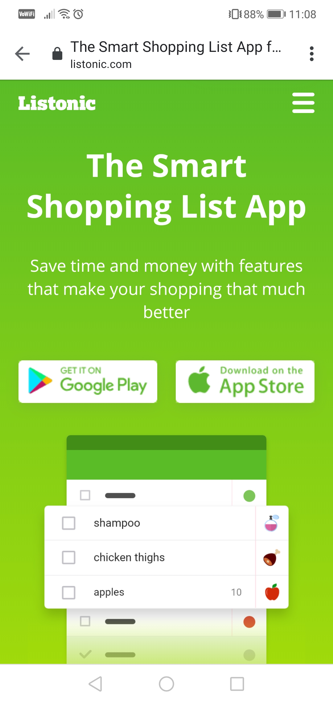

# Exploration Testing 1
> https://listonic.com/

## Table of contents
* [General info](#general-info)
* [Screenshots](#screenshots)
* [Technologies](#technologies)
* [Steps](#steps)
* [Result](#result)
* [Expected result](#expected-result)

## General info
Exploration testing project created to train testing skills after testing course.

## Screenshots

## Technologies
* System: Android DT.POL. 9.1.0.5(CT.F01) (9.1.0.306(C432E6R1P7))
* Web Browser: Google Chrome 81.0.4044.138

## Steps
* Open site: https://listonic.com/
* Log on to existing user profile with valid credentials
* Click "Współdzielenie listy" button above and put an existing email address
* Log on to this email and click the message from Listonic with registration option.
* Click the registration link

## Result
* Listonic main site opens

## Expected result
* Expected result:
Listonic registration landing site opens