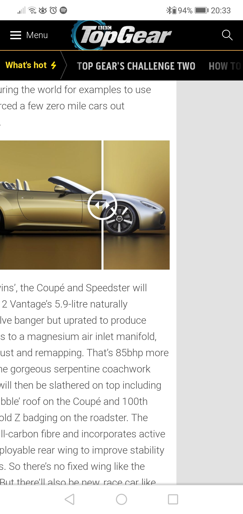

# Exploration Testing 1
> https://www.topgear.com/car-news/retro/good-news-you-can-buy-new-old-aston-martin-v12-zagato

## Table of contents
* [General info](#general-info)
* [Screenshots](#screenshots)
* [Technologies](#technologies)
* [Steps](#steps)
* [Result](#result)
* [Expected result](#expected-result)

## General info
Exploration testing project created to train testing skills after testing course.

## Screenshots

## Technologies
* System: Android DT.POL. 9.1.0.5(CT.F01) (9.1.0.306(C432E6R1P7))
* Web Browser: Google Chrome 81.0.4044.138

## Steps
* Open site: https://www.topgear.com/car-news/retro/good-news-you-can-buy-new-old-aston-martin-v12-zagato
* Scroll down to the first photo
* Touch the screen on the photo, and move the slider to the left

## Result
* The slider moves to the left, as well as the page.

## Expected result
* The slider moves, but the page doesn't move.