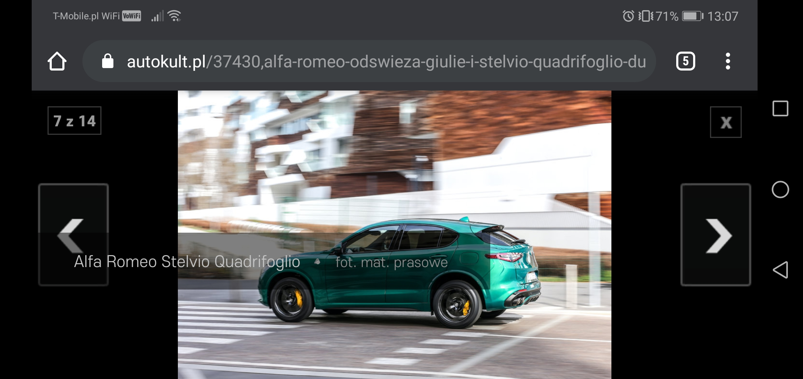

00# Exploration Testing 1
> https://autokult.pl/37430,alfa-romeo-odswieza-giulie-i-stelvio-quadrifoglio-duza-porcja-elektroniki-oraz-szczypta-emocji?wga_sa=article-intext

## Table of contents
* [General info](#general-info)
* [Screenshots](#screenshots)
* [Technologies](#technologies)
* [Steps](#steps)
* [Result](#result)
* [Expected result](#expected-result)

## General info
Exploration testing project created to train testing skills after testing course.

## Screenshots

## Technologies
* System: Android DT.POL. 9.1.0.5(CT.F01) (9.1.0.306(C432E6R1P7))
* Web Browser: Google Chrome 81.0.4044.138

## Steps
* Open site: https://autokult.pl/37430,alfa-romeo-odswieza-giulie-i-stelvio-quadrifoglio-duza-porcja-elektroniki-oraz-szczypta-emocji?wga_sa=article-intext
* Scroll down the page until the photo gallery
* Click on the gallery
* Rotate the screen

## Result
* The photo caption from the bottom is covering the central part of the photo, after the screen rotation.

## Expected result
* Expected result:
The photo caption is still below the photo after the screen rotation.